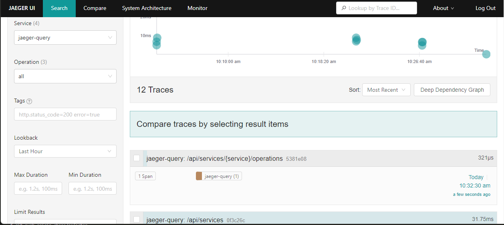

# OpenTelemetry - With Jaeger

This is a small demo project to show case the use of OpenTelemetry with Microservices using Jaeger as the collector.

The project consists of two simple NodeJs backends one representing the main API and the other a simplistic auth service which exists solely to provide a second service for the main service to call.

The main app can be found in the folder main-app and the auth similarly in the auth-app folder. Both apps contain a Dockerfile for deploying the services to a suitable host. This project was developed using OpenShift 4 Local cluster, but in principle it should work in other environments.

The project is simply a PoC and does not follow any best practices.

## Components

Both services expect to find a Jaeger host running at the following location 'http://jaeger-all-in-one-inmemory-collector.jaeger.svc:14268/api/traces' however this can be configured via the environment variable:

'JAEGER_END_POINT'

The auth service requires a postgreSql database to be available with a database 'auth' containing a table 'User'. The database connection string is configured via the environment variable:

The auth service is expects to read a record from a postgre database called 'auth' from a table called 'User'.

The database connection is confuigured via the environment variable 'DATABASE_URL' which creates the Prisma database connection when 'npx prisma generate' is run.

## Project Setup

### OpenShift

* Login into the Openshift UI as the kubeAdmin and add the following Operator 'Jaeger' provided by Redhat, Accept the defaults and create the Operator, this will take a few minutes to create.

* login back in as the 'developer'

* create a new project if one is not already existing

* Add the operator to the project by selecting +Add - operator backed and select the Jaeger Operator.
* Click on Create and accept the defaults, this should deploy the Jaeger operator, if successful clicking on the OpenUrl on the Jaeger Pod in topology should open the Jaeger UI  which will look like the below:

* Next using the Openshift template for PostgreSQL create a new Postgresql using +Add Database and selecting either the Postgresql or Postgresql Ephemeral. Leave the database service name as postgresql but change the PostgreSQL database name to auth. If using the non ephemeral version of Postgresql a persistent volume called 'postgresql' will need have been created before the instance can be created.

The user name and password can be set, or left to Openshift to create and then retrieved from secrets. These will be needed for the auth build.

Once the database is running connect to the database and create a table called User with the following columns: id text, username: text insert two rows one of which should have the username 'test'

* Next add two new items to the project using +Add gitRepository, 
* Copy the git repo Url
* Select git advanced options and change the context dir to main-app for the first item and auth-app for the second one, in both cases it should find a docker file in these locations, change the "Name" to main-app and auth-app respectively.
* Target Port main app expects to listen on Port 3000 and auth-app on Port 3010 
* For the main-app opt to create a route, for the auth-app a route is not needed the main app calls the "service" linked to the auth-app, this is configured via an environment variable in the main-app called 'AUTH_URL'. On Openshift this is simply the name of the auth-app service and port as in:
'http://auth-app:3010'.
* For the auth-app build an evironment variable called URL needs to be created the value for this should be:
DATABASE_URL=postgresql://<User>:<Password>@postgresql:5432/auth?schema=public
the user and password can be retrieved from the secrets within Openshift.

* Both the main app and auth app should build successfully.

The deployment for auth-app has an optional environment variables:
* WAIT_DELAY which is used to add delay to the time taken to fetch a record from the database the default value is one second and it is used to for illustrating the effect within Jaeger.
* JAEGER_END_POINT - defines the end point for sending traces to Jaeger in the form of:
http://jaeger-all-in-one-inmemory-collector.jaeger.svc:14268/api/traces 
This is the name of the jaeger service followed by the project name 'jaeger.svc' 
* PORT - port on which the application is running

The deployment for the main app requires the end point for the auth-service:
* AUTH_URL - which is the service name of the auth app in the format of http://<service name>:port
* PORT - port on which the application is running

If everything is working the tracing can be tested by posting to the main-app route:

e.g.
https://main-app-jaeger.apps-crc.testing/auth/login including the following data in the body:
{
userName: 'xxxx'
password: 'yyyy'
}
The values here are not relevent.

All being well the response should include: 
{ 
  id: '2'
  'username': 'test'
}

